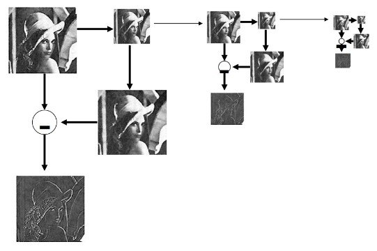
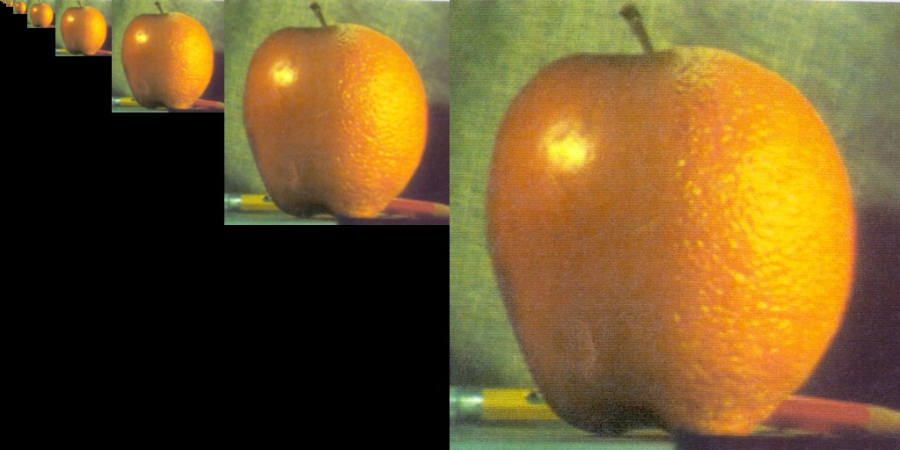

# 2021-CV-homework-and-project
大三上 计算机视觉课程作业和资料等
- [2021-CV-homework-and-project](#2021-cv-homework-and-project)
- [HW1: Image Blending based on Laplacian Pyramid](#hw1-image-blending-based-on-laplacian-pyramid)
	- [Requirements:](#requirements)
	- [Algorithm:](#algorithm)
	- [一张图解释 LapLacian Pyramid 的产生过程](#一张图解释-laplacian-pyramid-的产生过程)
	- [How to use?](#how-to-use)
	- [Issues and Contact](#issues-and-contact)
# HW1: Image Blending based on Laplacian Pyramid

 

Version 1.0   2021/9/28


- [2021-CV-homework-and-project](#2021-cv-homework-and-project)
- [HW1: Image Blending based on Laplacian Pyramid](#hw1-image-blending-based-on-laplacian-pyramid)
	- [Requirements:](#requirements)
	- [Algorithm:](#algorithm)
	- [一张图解释 LapLacian Pyramid 的产生过程](#一张图解释-laplacian-pyramid-的产生过程)
	- [How to use?](#how-to-use)
	- [Issues and Contact](#issues-and-contact)

## Requirements: 

```
Ubuntu 18.04
OpenCV 4.5.3
gcc/g++ 8.1.0
```


## Algorithm:

```
Input: Image1, Image2, Mask1, Mask2, level
Output: Blended_image

Step 1: 建立 Image1 和 Image2 的 Laplacian Pyramid：
	Step 1.1: 设 Current_Img = Image1, 对 Current_Img 进行高斯下采样得到 Down
	Step 1.2: 对 Down 高斯上采样得到 Up
	Step 1.3: Laplacian_Pyramid_layer_i = Current_Img - Up, 并将其存入Pyramid中
    Step 1.4: Current_Img = Down 重复 1.1->1.4 level-1 次 得到 Image1 的 Laplacian Pyramid1 并保存最高层的 Down_1
    Step 1.5 对 Image2 同样执行 1.1->1.4 得到 Image2 的 Laplacian Pyramid2 并保存最高层的 Down_2
    
Step 2: 建立 Blended Laplacian Pyramid：
	按照 Mask1 和 Mask2 合并 Laplacian Pyramid1 和 2 的每层对应的图片
	得到 Blended Laplacian Pyramid
	
Step 3: 重建原图:
	Step 3.1: 将 Down_1 和 Down_2 按照 Mask1 和 Mask2 合并为一张图 Down_Img
	Step 3.2: 将 Down_Img 上采样, 得到 Up_Img
	Step 3.3: Recon_Img = Up_Img + Blended Laplacian Pyramid layer i
	Step 3.4: 重复 3.1->3.3 level-1 次 得到的最大的重建的结果即为 Blended_Image
```

## 一张图解释 LapLacian Pyramid 的产生过程



最下面的这个灰色的就是LapLacian Pyramid各层的图片了

此图来源于 https://blog.csdn.net/u013165921/article/details/78156202

## How to use?

按照最上面的 Requirements 配置好之后

编译运行` Image_Blending.cpp `即可, 程序内有注释

只需要修改`main`函数的`path1`， `path2` ，`mask1`和 `level `即可

默认的`mask1`和 `level ` 分别为


背景是白色的可能看不太出来，左半边是白色，右半边是黑色

`level` 默认为 `10`

编译运行后 会输出结果如下:

左边是`Image1`   中间是`Image2`  右边是融合结果`Blended Img`


关闭这个对话框之后 会显示出重建的过程



关闭这个对话框之后，程序结束

## Issues and Contact

 📫：  `lizuoou@126.com`

